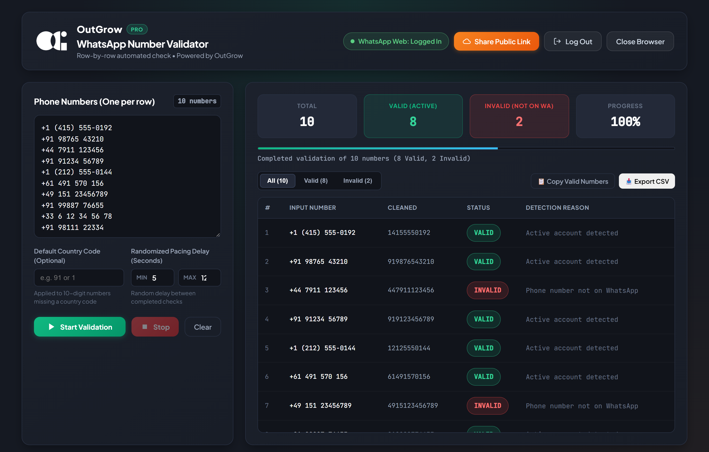
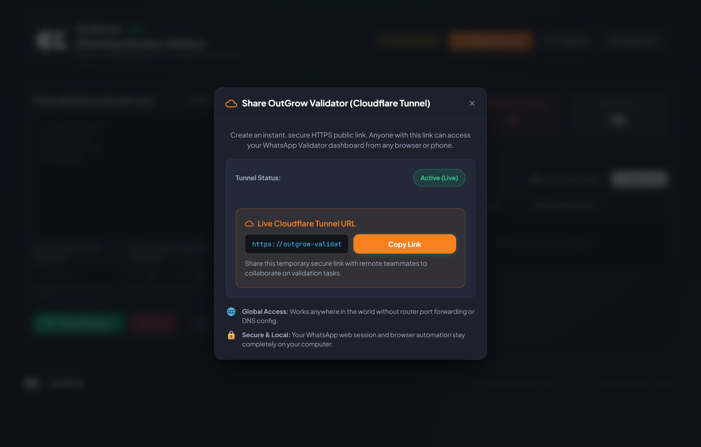

# 🪟 OutGrow | WhatsApp Phone Number Validator (Windows Edition)

<div align="center">
  
  <br/>
  <p><strong>Enterprise-grade automated WhatsApp phone number verification & list hygiene platform built natively for Windows.</strong></p>

  [-0078D6?style=for-the-badge&logo=windows&logoColor=white)](https://github.com/)
  [](https://www.electronjs.org/)
  [](https://playwright.dev/)
  [](https://nodejs.org/)
  [](https://developer.mozilla.org/en-US/docs/Web/API/Server-sent_events)
  [-blueviolet?style=for-the-badge)](#-download--quick-start)
</div>

---

## 📌 Executive Summary

**OutGrow WhatsApp Validator** is an automated desktop application engineered for high-throughput contact database verification, marketing list sanitization, and customer onboarding hygiene. 

By orchestrating headless browser automation via **Playwright** behind a sandboxed **Electron** desktop interface, the tool verifies whether lists of international phone numbers are registered on WhatsApp—without risking account flags or relying on expensive third-party APIs.

> **Note**: This repository serves as the official portfolio showcase and binary release portal. The underlying automation engine and proprietary heuristic algorithms are maintained in a private repository.

---

## 📸 Application Showcase

### 1. Live Real-Time Dashboard
*Dark Graphite & Emerald UI displaying real-time progress metrics, total numbers, valid/invalid counters, randomized delay pacing, and searchable result stream.*



---

### 2. In-App QR Code Authentication
*Seamless session linking directly inside the app shell—no detached browser windows required. Session cookies and local storage tokens persist securely in `%APPDATA%` across launches.*


---

### 3. Remote Cloudflare Tunnel Collaboration
*One-click instant HTTPS tunnel provisioning to share live validation runs and monitoring with distributed remote team members securely.*



---

## 🏗️ Technical Architecture & Engineering Highlights

```
┌─────────────────────────────────────────────────────────────┐
│                 Electron Desktop Application                │
│                                                             │
│  ┌───────────────────────┐       ┌───────────────────────┐  │
│  │   Chromium Renderer   │       │   Node.js Main Loop   │  │
│  │   • Dark Graphite UI  │◄─────►│   • Single-Instance   │  │
│  │   • Live SSE Client   │       │   • Window Lifecycle  │  │
│  └───────────▲───────────┘       └───────────▲───────────┘  │
└──────────────┼───────────────────────────────┼──────────────┘
               │ Event-Driven Streams (SSE)    │ IPC Bridge
┌──────────────▼───────────────────────────────▼──────────────┐
│                    Local Express API Service                │
│  • Pacing Controller    • Session Manager   • Export Engine │
└──────────────────────────────┬──────────────────────────────┘
                               │ Orchestration
┌──────────────────────────────▼──────────────────────────────┐
│                  Playwright Automation Core                 │
│  • Headless Chromium Engine   • Anti-Ban Heuristic Monitor  │
│  • Persistent Session Store   • Rate-Limit Graceful Cutoff  │
└─────────────────────────────────────────────────────────────┘
```

- **Electron Desktop Shell**: Implements a secure sandboxed window structure (`contextIsolation: true`, `nodeIntegration: false`), single-instance application lock, and native Windows integration.
- **Playwright Automation Engine**: Direct low-level browser interaction with automated DOM selector fallback logic to handle WhatsApp Web UI updates seamlessly.
- **Proprietary Anti-Ban & Safety Safeguards (`SECURITY_STOP`)**: Real-time regex pattern monitors that actively scan WhatsApp's DOM for safety triggers (`unusual activity`, `rate limit`, `temporarily restricted`, `security check`). Automatically stops validation immediately to protect the user's phone number.
- **Event-Driven Reactive Streaming**: Uses **Server-Sent Events (SSE)** with persistent 20-second heartbeats, pushing real-time per-number verification results to the frontend with zero polling overhead.
- **Human Pacing Emulation**: Randomized min-to-max decimal delay intervals between lookups (e.g., 2.5s – 5.0s) simulating human keyboard and mouse latency.
- **Zero-Install Portable Distribution**: Self-contained, pre-compiled standalone Windows 64-bit executable that runs out of the box with zero npm or runtime prerequisites.

---

## ⚡ Technical Specifications

| Component | Technology / Implementation |
| :--- | :--- |
| **Target OS** | Windows 10 & Windows 11 (x64) |
| **Frontend Shell** | Electron 41.x |
| **Automation Core** | Playwright Chromium Engine |
| **Backend Service** | Node.js + Express 4.x |
| **Streaming Protocol** | Server-Sent Events (SSE) |
| **Session Persistence** | `%APPDATA%\OutGrow WhatsApp Validator\.wweb_session` |
| **Packaging / Dist** | Electron-Builder (NSIS & Portable Executable) |
| **Networking** | Integrated Cloudflare Tunnel for secure HTTPS port forwarding |

---

## 🚀 Download & Quick Start

The pre-compiled, standalone Windows executable is available directly under **Releases**:

1. Navigate to the [**Releases**](https://github.com/) section on the right side of this repository.
2. Download **`OutGrow_WhatsApp_Validator_Portable.exe`** from the latest release (`v1.0.0`).
3. Double-click the `.exe` file to run immediately (no installation or setup required).

> [!NOTE]
> **Windows SmartScreen Note:**  
> As this is an independent build without an expensive enterprise code-signing certificate, Windows SmartScreen may show an alert on first launch. Click **"More info"** $\rightarrow$ **"Run anyway"**.

---

## 🔒 Security & Safe Usage

- Built for legitimate contact database sanitization, customer onboarding verification, and database deduplication.
- Strictly adheres to human-simulated pacing recommendations to avoid triggering platform rate thresholds.
- All session data and authentication keys are stored exclusively on your local machine and are never transmitted to external cloud servers.

---

## 📄 License & Rights

Copyright © 2026. All rights reserved.  
The source code and proprietary automation mechanisms of this project are private. Pre-built standalone binaries are distributed solely for evaluation and showcase purposes.
